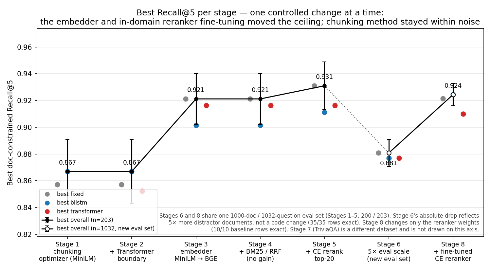

# Retrieval-aware RAG Chunking Optimizer

Find the chunking strategy that retrieves answer-bearing passages best — *fairly*.
A BiLSTM trained on Wikipedia *section* pseudo-labels predicts where a topic
changes; **target-size semantic cutting** turns those predictions into chunks
that stay size-comparable to a fixed-size baseline. The optimizer then sweeps
both strategies across chunk sizes and overlap settings and ranks them on
**Natural Questions (NQ)** by doc-constrained Recall@k.

> **This project does not assume learned chunking always wins.** It controls for
> chunk size and overlap, then measures which strategy retrieves answer-bearing
> chunks better — and exports the best configuration it finds.

> No paid APIs. Runs end-to-end on the Colab free tier (T4 GPU). Every phase
> caches to Google Drive and is resumable.

---

## Pipeline

| Phase | What it does | Module / script |
|---|---|---|
| 1 | Wikipedia → `(sentences, labels)` with real section boundaries | `rag_chunk/wiki_data.py` · `scripts/1_prepare_data.py` |
| 2 | Offline sentence embeddings (`all-MiniLM-L6-v2`, d=384) | `rag_chunk/embedding.py` · `scripts/2_embed_offline.py` |
| 3 | Train BiLSTM (weighted BCE, early stopping) | `rag_chunk/training.py`, `models/bilstm.py` · `scripts/3_train.py` |
| 4 | Chunk NQ docs (learned vs fixed) → FAISS `IndexFlatIP` | `rag_chunk/retrieval.py`, `chunking.py`, `nq_data.py` · `scripts/4_build_index.py` |
| 5 | Recall@k + Boundary F1 → table & figure | `rag_chunk/evaluation.py`, `metrics.py` · `scripts/5_evaluate.py` |
| 6 | Sweep fixed + learned chunking → best config, fair table, plots | `rag_chunk/sweep.py` · `scripts/6_sweep_chunking.py` |
| 7 | Train Transformer boundary model (Stage 2) | `models/transformer_boundary.py` · `scripts/7_train_transformer.py` |
| 8 | Sweep fixed + BiLSTM + Transformer | `rag_chunk/sweep.py` · `scripts/8_sweep_with_transformer.py` |

Phases 1–5 are the original pipeline (single fixed-vs-learned comparison, kept
working unchanged). **Phase 6** is the Stage 1 optimizer layer. **Phases 7–8**
are Stage 2: a Transformer boundary model compared three ways against fixed and
BiLSTM under the same protocol (see
[`docs/stage2_transformer_boundary.md`](docs/stage2_transformer_boundary.md)).
**Phase 9** is Stage 3: keep the existing MiniLM boundary/chunking models and
rerun only the retrieval FAISS/query embeddings with BGE (see
[`docs/stage3_bge_retrieval.md`](docs/stage3_bge_retrieval.md)). **Phase 10** is
Stage 4: rank the identical chunks with BGE-only, BM25-only, and BGE+BM25 RRF
(see [`docs/stage4_hybrid_retrieval.md`](docs/stage4_hybrid_retrieval.md)).
**Phase 11** is Stage 5: reorder the BGE top-k candidates with an off-the-shelf
cross-encoder reranker (see [`docs/stage5_reranker.md`](docs/stage5_reranker.md)).
**Phase 12** is Stage 6: re-run the whole comparison at ~5× scale
(1000 docs / 1032 questions) and test whether the Stage 1–5 conclusions
replicate (see [`docs/stage6_large_eval.md`](docs/stage6_large_eval.md)).
**Phase 13** is Stage 7: the same bge-only sweep on a *different QA dataset*
(TriviaQA rc.wikipedia) to test whether the headline transfers across
datasets (see [`docs/stage7_cross_dataset.md`](docs/stage7_cross_dataset.md)).
**Phase 14** is Stage 8: fine-tune the cross-encoder reranker on the NQ
*train* split (disjoint from every eval bench) behind a cheap dev-set
go/no-go gate (see
[`docs/stage8_reranker_finetune.md`](docs/stage8_reranker_finetune.md)).

---

## How to run (Google Colab)

1. Upload this whole `RAG chunk optimize` folder to your Drive, e.g.
   `MyDrive/RAG chunk optimize`.
2. Open `notebooks/RAG_chunk_optimize_colab.ipynb` in Colab.
3. Runtime → Change runtime type → **GPU**.
4. Run the cells top-to-bottom. The first runnable section is a **smoke test**
   that runs all five phases at tiny scale (a few minutes) in a separate
   `*_smoke` folder — use it to catch any Colab/dataset issue before committing
   to the full run. It restores the real config automatically.

The notebook mounts Drive, sets `RAG_DATA_ROOT` to
`<project>/artifacts`, and runs Phases 1–5. Artifacts (parsed Wikipedia,
embeddings, model, FAISS indices, results) all land under that folder and
survive session restarts.

### Or via the scripts (CLI / local)

```bash
pip install -r requirements.txt          # + torch if running locally
export RAG_DATA_ROOT=./artifacts         # optional; defaults to a Drive path
python scripts/0_smoke_test.py           # optional: tiny end-to-end plumbing check
python scripts/1_prepare_data.py
python scripts/2_embed_offline.py
python scripts/3_train.py
python scripts/4_build_index.py
python scripts/5_evaluate.py
python scripts/6_sweep_chunking.py --quick   # fast grid; drop --quick for the full sweep
```

On **Windows PowerShell** the env-var syntax differs:

```powershell
pip install -r requirements.txt          # then install torch separately, see below
$env:RAG_DATA_ROOT = ".\artifacts"
python scripts\0_smoke_test.py
# ... scripts\1_prepare_data.py ... scripts\5_evaluate.py
```

> `requirements.txt` deliberately does **not** pin `torch` (Colab ships it). To
> run locally install a build for your platform from <https://pytorch.org> first.
> `faiss-cpu` wheels exist for Windows but can lag; if `pip install faiss-cpu`
> fails, use Colab or WSL. The intended target is Colab — local runs are a
> convenience, not the primary path.

### Reproducing the full study from scratch (Stages 1–6)

The archived numbers in `artifacts/results/stage*/final/` were produced on the
Colab free tier (T4) in June–July 2026. To redo the whole chain on a fresh
machine or Drive:

1. **Environment.** Python ≥ 3.10, `pip install -r requirements.txt`, plus a
   `torch` build for your platform (Colab ships one). The requirements are
   verified to resolve on Python 3.12 (2026-07), but they are floors, not a
   freeze — newer library versions can move recall values in the third
   decimal; it is the *directional* conclusions that should replicate.
2. **Plumbing check.** `python scripts/0_smoke_test.py` — the whole Phase 1–5
   pipeline at tiny scale in a separate `*_smoke` folder (a few minutes).
3. **Base pipeline (Phases 1–5).** Run `scripts/1_prepare_data.py` →
   `2_embed_offline.py` → `3_train.py` → `4_build_index.py` → `5_evaluate.py`.
   This downloads and caches Wikipedia + NQ and trains the BiLSTM; every later
   stage reuses these caches and weights unchanged.
4. **Stages 1–2** (MiniLM chunking sweep): `python scripts/7_train_transformer.py`,
   then `python scripts/8_sweep_with_transformer.py`, then archive with
   `python scripts/save_stage_results.py --stage stage2`. (The fixed + BiLSTM
   subset of this sweep *is* the Stage 1 result — see the archive-gap note
   below.)
5. **Stage 3** (embedder swap): `python scripts/9_sweep_bge_retrieval.py` →
   archive `--stage stage3`.
6. **Stage 4** (hybrid): `python scripts/10_sweep_hybrid_retrieval.py` →
   archive `--stage stage4`. Its `bge` arm re-runs the exact Stage 3 path and
   the script checks it reproduces `stage3/final` **exactly** — only then do
   the BM25/RRF arms mean anything.
7. **Stage 5** (reranking): `python scripts/11_sweep_reranker.py` → archive
   `--stage stage5`. Same built-in exact-reproduction check.
8. **Stage 6** (5× scale): `python scripts/12_large_eval.py --check` first —
   it must report all 35 rows identical to `stage5/final` — then
   `python scripts/12_large_eval.py` (hours; checkpointed and resume-safe),
   then `python scripts/13_stage6_plots.py`, then archive `--stage stage6`.
9. **Stage 7** (cross-dataset): `python scripts/15_cross_dataset_eval.py
   --check` first — it must reproduce `stage3/final` exactly — then
   `python scripts/15_cross_dataset_eval.py` (streams TriviaQA rc.wikipedia
   from Hugging Face automatically; checkpointed and resume-safe), then
   archive `--stage stage7`.
10. **Stage 8** (reranker fine-tuning, GPU):
    `python scripts/16_build_rerank_train_data.py` (mines training groups
    from the NQ *train* split) → `python scripts/17_train_reranker.py`
    (~17 min on a T4) → `python scripts/18_eval_reranker_ft.py --dev` and
    read the printed **GO / NO-GO** verdict → only on GO,
    `python scripts/18_eval_reranker_ft.py` (its bge + rerank20 rows must
    reproduce `stage6/final` exactly) → archive `--stage stage8`.
11. **Portfolio figure.** `python scripts/14_evolution_plot.py` (reads only
    the archived finals).

Every stage writes to `artifacts/results/latest/` first;
`save_stage_results.py` snapshots that into `stage*/final/`. The
check-before-conclude discipline in steps 6–8 is what makes a rerun
trustworthy: a stage's new arms are only interpretable after its baseline arm
has reproduced the previous stage's archive byte-for-byte. There is no
separate pytest suite — the smoke test (step 2) and these exact reproduction
checks are the verification gates.

### Interactive demo

`python scripts/19_demo.py --share` (`pip install gradio`; the notebook has a
Route D cell) serves a side-by-side retrieval demo on the Stage 6 bench:
fixed 15/0 vs BiLSTM t15/0, ranked by `bge` / off-the-shelf `rerank20` / the
Stage 8 fine-tuned `rerank20_ft` — all sharing one BGE top-20 pool. Bench
questions highlight the answer string, badge gold-document chunks, and show
each chunk's dense-rank movement after reranking. It runs no experiments and
writes nothing under `results/`; the two demo FAISS indices are built once
and cached under `data/nq/large_n1000/indices/demo/`.

---

## Results

### The whole project in one figure



Seven stages on this axis, one controlled change each. Only two changes ever
moved the ceiling: the retrieval **embedder** (Stage 3, MiniLM → BGE, +0.054
R@5) and **in-domain fine-tuning of the reranker** (Stage 8, +0.044 R@5 and
+0.107 R@1 over the off-the-shelf reranker at the best config). Swapping the
chunking *method* (Stages 1–2), adding BM25/RRF hybrid retrieval (Stage 4),
and the *off-the-shelf* reranker (Stage 5, +0.010 R@5, within noise) never
did; the colored per-method dots stay clustered at every stage. Stage 6
re-runs the identical pipeline at 5× evaluation scale and everything
replicates — its lower absolute number reflects the 5× larger distractor pool
(new eval set), not a regression; Stage 8 shares that same eval set, so the
Stage 6 → 8 segment is directly comparable. Stage 7 repeats the bge-only
sweep on a *second dataset* (TriviaQA rc.wikipedia) and the size-over-method
headline replicates there too (4/4 direction checks — different dataset, so
it is not drawn on this axis).
Regenerate with `python scripts/14_evolution_plot.py` (reads only the archived
`stage*/final/` CSVs; writes `artifacts/results/portfolio/`).

Evaluated on **200 NQ documents / 203 questions**, doc-constrained Recall@k, every
learned config size-matched to fixed-size (the Stage 2 sweep, MiniLM embeddings).

> **Headline: at a matched chunk size the three methods are statistically
> indistinguishable — Recall@k is driven by chunk _size_, not chunk _method_.**

| Method | Best Recall@5 | Best config |
|---|---|---|
| Fixed-size | 0.857 | size 15, overlap 1 |
| BiLSTM | 0.867 | target 15, overlap 0 |
| Transformer | 0.852 | target 12, overlap 0 |

- Best learned − best fixed = **+0.010 R@5**, but the standard error of that
  difference is **±0.034** (n = 203) → *z* ≈ 0.3, **not significant** (p > 0.05).
- Recall tracks size, not method: **Pearson r(avg chunk size, R@5) = +0.77**; going
  from ~8 to ~12 sentences adds **≈ +0.04 R@5**, whereas the method spread *at a
  matched size* is only 0.015–0.045 and has no stable winner (at size 8 the
  Transformer trails fixed; the leading method changes with size). A nuisance knob
  (overlap) swings one method's R@5 by up to 0.054 — larger than the method effect
  itself. A regression of R@5 on size + method dummies makes it explicit: **size
  contributes +0.07 across the swept range while both method effects stay ≤ 0.014
  (≈ 5× smaller)**. See `artifacts/results/latest/recall_vs_size_scatter.png`.

**Why this is the ceiling (not a bug).** The training objective (Wikipedia
*section* pseudo-labels, weighted BCE) is misaligned with the evaluation
(retrieval Recall@k), and the **frozen MiniLM sentence embeddings carry only a weak
topic-boundary signal** (boundary precision ≈ 0.13, only ~1.4× the base rate). The
high-leverage gains live in the *embedder* and a *retrieval-aligned* objective —
not a bigger boundary network.

**Stage 2.1 — calibration caught a real failure.** The Transformer first reported
Boundary F1 ≈ 0. The added validation threshold sweep + probability diagnostics
showed its sigmoid outputs had collapsed to a near-constant (~0.55): unit-amplitude
positional encoding was swamping the small frozen MiniLM vectors (~10–40×). An
input `LayerNorm` restores the content↔position balance, after which the model
becomes discriminative and competitive (table above). Details:
[`docs/stage2_transformer_boundary.md`](docs/stage2_transformer_boundary.md).

### Stage 3 — swapping the retrieval embedder (MiniLM → BGE)

A controlled ablation on top of the Stage 2 sweep: **only the retrieval embedding
model changes** (`all-MiniLM-L6-v2` → `BAAI/bge-base-en-v1.5`) while chunks, chunk
sizes, corpus and questions are held identical — every matched row has
Δ avg-chunk-size ≈ 0 and Δ n-chunks = 0. This is the direct test of the Stage 2
prediction that the high-leverage knob is the *embedder*, not the boundary network.

> **Headline: the embedder is where the recall is. BGE beats MiniLM on all 30 / 30
> matched configs (mean +0.054 R@5, +0.080 R@1) and lifts the ceiling from 0.867 to
> 0.921 R@5 — a large, consistent effect, in contrast to the within-noise Stage 2
> _method_ differences.**

| Retrieval embedder | Best Recall@5 | Best config | Mean Δ vs MiniLM |
|---|---|---|---|
| MiniLM (Stage 2) | 0.867 | bilstm target 15, overlap 0 | — |
| BGE-base (Stage 3) | **0.921** | fixed size 15, overlap 0 | +0.054 R@5, +0.080 R@1 |

- **Consistent, not cherry-picked.** All 30 matched configs improve on R@1, R@3 and
  R@5 (30/30 each); a sign test alone gives *P* ≈ 9×10⁻¹⁰ under the no-effect null.
  At the best config BGE adds **+0.113 R@5** — ≈ 23 of 203 questions — a paired
  *z* ≳ 3.4 (contrast Stage 2's *z* ≈ 0.3).
- **The "size > method" finding survives the swap.** *Within* BGE the three methods
  still tie at matched size (at size 15 / overlap 0: fixed 0.921, transformer 0.916,
  bilstm 0.902 — inside one SE ≈ 0.019) and larger chunks still win. So the Stage 2
  conclusion is robust to a much stronger embedder; the embedder is a *separate,
  bigger* lever stacked on top.
- **Same fair-comparison harness.** Identical chunks / metric / questions; BGE
  queries use its instruction prefix and L2-normalised cosine. Full matched table:
  `stage2_vs_stage3_matched.csv`; details in
  [`docs/stage3_bge_retrieval.md`](docs/stage3_bge_retrieval.md).

### Stage 4 — hybrid retrieval (BGE vs BM25 vs RRF over identical chunks)

A retriever ablation on top of Stage 3: chunks, sweep configs, corpus and
questions all held identical — only the *ranker* changes. Three retrievers per
config: BGE dense (the exact Stage 3 path), pure-numpy Okapi BM25 over the same
chunk texts, and Reciprocal Rank Fusion of the two (`RRF_K=60`, depth 50). The
re-run BGE arm reproduces the archived Stage 3 baseline **exactly** (30/30
configs: Δ n-chunks = 0, every recall delta 0.0000), so all three retrievers are
scored against a verified-identical baseline.

> **Headline: hybrid does not help here. BGE-only keeps the ceiling (0.921 R@5);
> equal-weight RRF trails it slightly but consistently (mean −0.021 R@5, worse on
> 24 / 30 configs), because fusing in a much weaker lexical ranking — BM25 trails
> BGE by ~0.12 R@5 on average — dilutes the dense one.**

| Retriever | Best Recall@5 | Best config |
|---|---|---|
| BGE-only | **0.921** | fixed size 15, overlap 0 |
| RRF (BGE + BM25) | 0.887 | fixed size 15, overlap 0 |
| BM25-only | 0.803 | bilstm target 15, overlap 0 |

- **Per-config deltas are small but one-sided at R@5.** rrf − bge: mean −0.021,
  range −0.054…+0.035 — each within ~1 SE ≈ 0.027, but 24 of 30 configs are
  negative (sign test *P* ≈ 2×10⁻⁴), so the direction is consistent even though
  the size is marginal. At R@1 it is a wash (mean −0.007; 15 worse / 13 better /
  2 ties).
- **RRF beats BM25 everywhere** (30/30, mean +0.100 R@5): fusion recovers most
  of the dense quality — it is "safe" relative to BM25 — it just adds nothing on
  top of a strong dense retriever on this benchmark.
- **"Size > method" survives a third time.** All three retrievers gain with
  larger chunks (`hybrid_recall_vs_chunk_size.png`) and every retriever's best
  config sits at size 15.
- Artifacts: `hybrid_sweep_results.csv` (90 rows), `hybrid_retriever_matched.csv`,
  `stage3_vs_stage4_bge_check.csv`; details in
  [`docs/stage4_hybrid_retrieval.md`](docs/stage4_hybrid_retrieval.md).

### Stage 5 — cross-encoder reranking (BGE top-k + bge-reranker-base)

A ranking ablation on top of Stage 3/4: chunks, sweep configs, corpus, questions
and the BGE retriever all held identical — the only change is that the BGE top-k
candidate pool is *reordered* by the off-the-shelf cross-encoder
`BAAI/bge-reranker-base` (no training or fine-tuning) before the top-5 cut.
Three arms per config: `bge` (the exact Stage 3 path — re-verified to reproduce
the archived baseline exactly, 30/30), `rerank20`, and `rerank50`. The
candidate-pool ceiling is reported before any improvement claim: the answer
chunk is in the BGE top-20 for **96.5%** of questions on average (98.5% at
top-50), so ranking — not pool recall — is the binding constraint.

> **Headline: reranking is the first post-Stage-3 change that actually helps —
> but only with a *shallow* pool. Reranking the BGE top-20 adds a mean
> +0.044 R@1 (better on 26 / 30 configs, sign test *P* ≈ 1.5×10⁻⁵); widening
> the pool to top-50 only feeds the reranker distractors — it never beats
> top-20 on R@1 (0 / 30, *P* ≈ 7×10⁻⁹).**

| Arm | Best Recall@5 | Best config | Mean Δ vs BGE-only (R@1 / R@3 / R@5) |
|---|---|---|---|
| BGE-only | 0.921 | fixed size 15, overlap 0 | — |
| BGE top-20 + CE | **0.931** | fixed size 15, overlap 1 | +0.044 / +0.028 / +0.018 |
| BGE top-50 + CE | 0.916 | fixed size 15, overlap 1 | +0.024 / +0.019 / +0.013 |

- **The gain lives at small chunk sizes.** Mean rerank20−bge R@1 falls from
  **+0.075 at size ~6 to +0.002 at size 15**: the cross-encoder largely rescues
  badly-chunked (small) configs but adds nothing at the size-15 sweet spot,
  where the deltas sit inside noise (at the Stage 3 best config: +0.010 R@1,
  −0.010 R@3, −0.025 R@5; 1 SE ≈ 0.034). In
  `rerank_recall_vs_chunk_size.png` the rerank20 trend line is nearly flat —
  reranking *flattens the chunk-size effect* on R@1 rather than raising the
  ceiling.
- **Deeper pool ≠ better.** rerank50 sees strictly more candidates yet is
  ≤ rerank20 on R@1 in every one of the 30 configs (28 worse, 2 tied): a
  candidate past rank 20 is far more likely a distractor than the answer chunk
  (the pool ceiling gains only +0.02), and the cross-encoder sometimes promotes
  it over the true one.
- **Cost.** ≈ 24.7 ms per (question, chunk) pair on a T4 → ≈ 0.49 s per query
  at depth 20 and ≈ 1.18 s at depth 50 — real latency for gains that are
  noise-level at the best config; worth paying only when stuck with small
  chunks.
- Artifacts: `rerank_sweep_results.csv` (90 rows), `rerank_matched.csv`,
  `stage3_vs_stage5_bge_check.csv` (30/30 exact); details in
  [`docs/stage5_reranker.md`](docs/stage5_reranker.md).

### Stage 6 — larger-scale robustness check (1000 docs / 1032 questions)

Everything held identical to Stages 3–5 (dataset source, chunking grids,
boundary models/weights, BGE retriever, off-the-shelf reranker at top-20 only);
the **only** change is corpus scale, 200 → 1000 NQ docs (203 → 1032 questions),
which halves the sampling noise (1 SE ≈ 0.034 → 0.015). Before the large run, a
check mode re-ran the full pipeline at N=200 and reproduced the archived
Stage 5 rows **exactly** (35/35 rows, all deltas 0.0000) — so any difference at
scale is the data, not the code.

> **Headline: all four Stage 1–5 conclusions replicate at 5× scale — and the
> central one gets *stronger*: Pearson r(chunk size, R@5) rises from 0.77 to
> 0.95. The reranker's small-chunk rescue shrinks from +0.113 to +0.036 R@1
> (still > 2 SE), and its gain at the size-15 sweet spot stays zero.**

| # | Claim (from n=203) | Observed at n=1032 | Replicates |
|---|---|---|---|
| 1 | chunk size matters more than chunking method | r(size, R@5) = **0.95**; size effect 0.052 > method spread | yes |
| 2 | BGE-only stays a strong baseline | best R@5 = **0.881** (fixed 15/0; 0.921 at 200 docs — a drop is expected with 5× more distractor docs) | yes |
| 3 | rerank20 helps mainly at small chunks | ΔR@1 = **+0.036** at fixed 6/0 (2 SE = 0.031) vs ≈ 0 at size 15 | yes |
| 4 | rerank20 adds nothing at the size-15 sweet spot | max size-15 ΔR@1 = **+0.001** | yes |

- Best config overall is unchanged: **fixed size 15, overlap 0** —
  R@1 0.628 / R@3 0.816 / R@5 0.881 with BGE alone; reranking it moves R@1 by
  +0.001. The size-15 pool ceilings stay ≥ 0.95 (`pool_recall@20`
  0.957–0.964), so the candidate pool is still not the bottleneck.
- `stage6_size_vs_recall.png` shows the small and large evals side by side —
  same upward size trend, methods intermixed along it at both scales;
  `stage6_rerank_delta.png` shows the rerank20 gain collapsing toward zero
  everywhere except the deliberately-bad small-chunk config.
- Artifacts: `stage6_large_eval_results.csv` (35 rows with actual corpus
  counts), `stage6_matched_summary.csv`, `stage6_direction_check.csv`,
  `stage6_check_vs_stage5.csv` (35/35 exact), 2 figures; details in
  [`docs/stage6_large_eval.md`](docs/stage6_large_eval.md).

### Stage 7 — cross-dataset robustness check (TriviaQA rc.wikipedia)

The last remaining threat to the headline claim was dataset specificity:
every number so far came from NQ + its Wikipedia pages. Stage 7 re-runs the
identical 30-config **bge-only** sweep (same grids, boundary weights, BGE
retriever, doc-constrained metric) on **TriviaQA `rc.wikipedia`** — 300 kept
questions against 472 full Wikipedia entity pages bundled in the dataset (no
fetching). Gold documents are the question's entity pages whose text contains
the answer string — *distant supervision*, a weaker gold notion than NQ's
annotated documents, stated wherever these numbers appear; 118/300 questions
have two gold pages, handled by a backwards-compatible multi-gold extension
of the metric. Before the run, a check mode re-ran the sweep on the cached NQ
corpus and reproduced the archived Stage 3 rows **exactly** (30/30, all
deltas 0.0000) — so the code path, including the metric extension, is
verifiably the Stage 3 pipeline.

> **Headline: the size-over-method conclusion transfers. On TriviaQA,
> r(size, R@5) = 0.80, the methods stay tied at matched size (max size-15
> spread 0.020 < 2 SE = 0.036), and the best config is again a size-15 one —
> 4/4 direction checks replicate.**

| Eval | Best config | Best R@5 | r(size, R@5) | Size effect (6→15) |
|---|---|---|---|---|
| NQ (Stage 3, 203 q) | fixed 15/0 | 0.9212 | 0.86 | +0.062 |
| TriviaQA (Stage 7, 300 q) | bilstm t15/1 | 0.9200 | 0.80 | +0.036 |

- **The "winner" flips — which reinforces the tie.** Fixed won on NQ; BiLSTM
  edges ahead on TriviaQA by 0.013–0.020, well inside 2 SE. A method that
  genuinely won would not swap places across datasets; noise would.
- **The size effect is flatter here** (+0.036 vs +0.062 R@5 from size 6 to
  15): trivia questions against entity pages are already easy at small chunks
  (R@5 ≈ 0.87 at size ~6), leaving less headroom. Direction unchanged,
  magnitude dataset-dependent — reported as is.
- **Loader accountability:** 302 rows scanned → 300 kept (2 dropped with no
  answer candidate in their pages); median document 152 sentences, so the
  6–15 sentence grid stays meaningful (the degenerate-sweep guard that
  disqualified raw HotpotQA paragraphs — see the docs for why HotpotQA was
  rejected).
- Artifacts: `stage7_cross_dataset_results.csv` (30 rows),
  `stage7_matched_summary.csv`, `stage7_direction_check.csv`,
  `stage7_check_vs_stage3.csv` (30/30 exact), 1 figure; details in
  [`docs/stage7_cross_dataset.md`](docs/stage7_cross_dataset.md).

### Stage 8 — fine-tuning the cross-encoder reranker (NQ train split)

Stage 6 left a precise diagnosis: at the size-15 sweet spot the answer chunk
is in the BGE top-20 pool for ~96% of questions (`pool_recall@20`
0.957–0.964) yet R@1 ≈ 0.63, and the off-the-shelf reranker adds +0.001 —
**ranking, not pool recall, is the bottleneck**. Stage 8 tests the one model
change with theoretical headroom: fine-tune `BAAI/bge-reranker-base` on the
NQ **train** split (every eval bench uses the validation split). 2161 train
questions were mined into 2034 (1 positive + 7 hard-negative) groups at the
deployment chunking (fixed 15/0, BGE top-20 pool); training was 2 epochs of
listwise cross-entropy, 16.6 min on a T4. A held-out dev bench (400 docs /
406 questions) gated the expensive final eval: dev ΔR@1 (ft − ots) = +0.047 ≥
the pre-registered +0.02 threshold → **GO**. In the final run the `bge` and
`rerank20` arms re-ran the exact Stage 6 pipeline and reproduced
`stage6/final` **exactly** (10/10 rows, all deltas 0.0000) before the
fine-tuned arm was read.

> **Headline: the first intervention that works at the size-15 sweet spot.
> Fine-tuned − off-the-shelf ΔR@1 = +0.087…+0.107 across all five configs
> (2 SE = 0.030) — at fixed 15/0, R@1 goes 0.629 → 0.736, closing about a
> third of the gap to the 0.964 pool ceiling. R@3/R@5 rise too.**

| Config (1032 q) | bge R@1 | ots rerank R@1 | **ft rerank R@1** | ft − ots |
|---|---|---|---|---|
| fixed 6/0 | 0.509 | 0.545 | 0.650 | +0.106 |
| fixed 15/0 | 0.628 | 0.629 | **0.736** | **+0.107** |
| fixed 15/1 | 0.626 | 0.627 | 0.720 | +0.093 |
| bilstm 15/0 | 0.630 | 0.627 | 0.714 | +0.087 |
| transformer 15/0 | 0.637 | 0.625 | 0.732 | +0.107 |

- **The headline conclusions survive intact**: even with the fine-tuned
  reranker, chunk size still dominates (ft R@1 0.650 at size 6 vs 0.736 at
  size 15) and the size-15 methods still tie (ft R@5 spread 0.9099–0.9244,
  ≈ 2 SE). Fine-tuning lifts the whole curve; it does not change its shape.
- **Honest caveats:** the gain is *in-domain* (trained on NQ train, evaluated
  on NQ validation) — no transfer claim to other datasets is made. Questions
  are split-disjoint, but popular Wikipedia pages can appear in both splits'
  corpora (standard for NQ). Reranking costs ~0.56 s/question at depth 20 on
  a T4, unchanged by fine-tuning.
- Artifacts: `stage8_ft_eval_results.csv` (15 rows),
  `stage8_matched_summary.csv`, `stage8_dev_results.csv` + gate verdict,
  `stage8_check_vs_stage6.csv` (10/10 exact), 1 figure; model +
  `training_meta.json` under `models/bge_reranker_ft/`; details in
  [`docs/stage8_reranker_finetune.md`](docs/stage8_reranker_finetune.md).

### Post-Stage 8 robustness — effect sizes + cross-dataset reranker transfer

Two follow-ups that harden the conclusions without re-running the sweep.

**How big is the "method ties" null?** An OLS fit `R@5 ~ size + overlap +
C(method)` over the 30 archived Stage 6 dense configs puts the size effect at
+0.064 across 6→15 sentences (p ≈ 3e-16) — about **18×** the largest
chunking-method coefficient (0.0036, not significant, p = 0.23–0.87); overlap,
a nuisance knob, outweighs the method choice too. And the tie is not
underpowering: at n = 1032 the smallest between-method gap detectable at 95% is
0.032, yet the largest observed gap at any matched (size, overlap) cell is
0.023 — below that floor. So "size dominates, method ties" is a *measured*
null, not a lack of power. (`scripts/20_effect_size.py` →
`artifacts/results/portfolio/effect_size_*`.)

**Does the fine-tuned reranker's gain transfer?** Re-running the Stage 8
protocol on the TriviaQA bench (300 q) instead of NQ: the off-the-shelf
reranker *hurts* out-of-domain (ots − bge = −0.03…−0.07 R@1), and fine-tuning
recovers to **parity with the dense baseline** (ft − bge ≈ 0 at size 15) rather
than beating it as it did in-domain (+0.107). The +0.057 win over the
off-the-shelf reranker (fixed 15/0, just over 2 SE = 0.054, positive at 4/5
configs) is therefore **damage control, not net lift** — an honest, partial
transfer. The headline is untouched: chunking method still ties under the
fine-tuned reranker cross-dataset. Details in
[`docs/stage8_transfer.md`](docs/stage8_transfer.md).

---

## Key design decisions

- **Reliable section labels.** The cleaned `wikimedia/wikipedia` `text` field does
  **not** preserve `== Section ==` markers, so boundaries can't be recovered from
  it. Instead we pick article titles by streaming the dump, fetch the **raw
  wikitext** from the MediaWiki API (batched, cached, resumable), and parse the
  real section structure with `mwparserfromhell`. `labels[i] = 1` iff sentence
  `i+1` starts a new section.
- **Class imbalance.** Positives (~6%) are handled with a weighted BCE,
  `pos_weight = #neg/#pos` computed from the training split (~15).
- **Offline embeddings.** Sentence embeddings are computed once and cached, so
  training spends its time on the BiLSTM, not on re-embedding each epoch.
- **Honest Recall@k.** NQ document text and gold short-answer strings are
  reconstructed from the **same** token list with the same join rule, so a chunk
  covering the answer span substring-matches it after normalisation. A "miss"
  then genuinely means the answer's chunk wasn't retrieved (or chunking split it).
- **Doc-constrained Recall@k (the headline metric).** A short answer (a year, a
  common name, a place) can string-match a chunk from an *unrelated* document,
  which inflates recall — and can do so unevenly between the two methods. So each
  chunk stores its source document id, and the headline Recall@k only counts a
  hit when the matching chunk came from the question's **gold** document. The old
  "match any document" number is still reported as `unconstrained` for reference.
- **Cosine retrieval.** Chunk/question embeddings are L2-normalised and indexed
  with FAISS `IndexFlatIP`, so inner product = cosine similarity.
- **Cache invalidation by manifest.** The NQ corpus and the FAISS indices each
  store a small manifest of the settings they were built with (NQ corpus size /
  config; and for indices: boundary threshold, fixed chunk size, embedding model,
  a SHA-1 of the trained model weights, and a SHA-1 of the corpus *content* — doc
  titles + question/answer/doc-title — so a rebuilt corpus with the same counts
  still invalidates the index). Phase 5 rebuilds automatically when any of these
  change, so you never silently evaluate new settings against a stale index.
- **Config overrides take effect.** Functions that depend on a tunable
  (`BOUNDARY_THRESHOLD`, `FIXED_CHUNK_SIZE`, …) read it at call time rather than
  binding the import-time default, so `C.apply(BOUNDARY_THRESHOLD=0.7,
  FIXED_CHUNK_SIZE=10)` in a notebook actually changes chunking — and the manifest
  it's compared against — instead of silently using the old value.

## Configuration (`config.py`)

| Knob | Default | Meaning |
|---|---|---|
| `N_WIKI_ARTICLES` | 5000 | Wikipedia articles used to build the dataset |
| `HIDDEN_SIZE` | 128 | BiLSTM hidden size H |
| `MAX_EPOCHS` / `EARLY_STOP_PATIENCE` | 20 / 3 | training budget |
| `N_NQ_DOCS` | 200 | distinct NQ documents indexed (corpus size) |
| `BOUNDARY_EMBED_MODEL` | `sentence-transformers/all-MiniLM-L6-v2` | sentence embeddings used by BiLSTM/Transformer boundary models |
| `RETRIEVAL_EMBED_MODEL` | `sentence-transformers/all-MiniLM-L6-v2` | chunk/query embeddings used by FAISS retrieval; Stage 3 sets this to BGE |
| `FIXED_CHUNK_SIZE` / `FIXED_CHUNK_OVERLAP` | 10 / 1 | fixed-size baseline chunking |
| `BOUNDARY_THRESHOLD` | 0.8 | threshold-policy probability cut for "make a cut here" (BiLSTM) |
| `TRANSFORMER_BOUNDARY_THRESHOLD` | 0.5* | Transformer Boundary-F1 threshold; *calibrated on val by Phase 7 (diagnostic only — the sweep ignores it) |
| `SEMANTIC_CHUNK_POLICY` | `"target"` | learned cutting policy (`"target"` or `"threshold"`) |
| `SEMANTIC_TARGET/MIN/MAX_CHUNK_SIZE` | 10 / 6 / 12 | target-size cutting window |
| `SEMANTIC_OVERLAP` | 1 | sentence overlap between learned chunks |
| `RECALL_KS` | (1, 3, 5) | k values reported |
| `FIXED_SIZE_GRID` / `TARGET_SIZE_GRID` / `OVERLAP_GRID` | [6,8,10,12,15] / … / [0,1] | Phase 6 sweep grids |

NQ defaults to a 200-document subset because the full NQ validation set is far
too large for the free tier; bump `N_NQ_DOCS` for stronger numbers. To download
only the validation split faster you can switch `NQ_CONFIG` to `"dev"`.

**How the NQ subset is sampled.** We stream the validation split and stop as soon
as `N_NQ_DOCS` distinct documents with a usable short answer have been collected;
the questions are those encountered up to that point. This keeps the streamed
download small (the point of the free-tier target). It does mean later questions
for the same documents aren't gathered — if you want a larger, more balanced
query set, raise `N_NQ_DOCS` (more documents *and* more questions) rather than
expecting a longer scan of the same set.

## Chunking sweep optimizer (Phase 6)

The optimizer answers one question:

> At the same approximate chunk size and overlap, does learned **target-size**
> semantic cutting choose better boundaries than fixed-size cutting?

`rag_chunk/sweep.py` builds an in-memory FAISS index for every configuration in a
grid, scores it on NQ doc-constrained Recall@k, and writes the artifacts below.
The boundary model runs once per document and is reused across every learned
config, and per-config indices are discarded after scoring — so the full grid
stays Colab-friendly and never litters `nq/` with FAISS files.

```bash
python scripts/6_sweep_chunking.py            # full grid
python scripts/6_sweep_chunking.py --quick    # smaller, fast grid
python scripts/6_sweep_chunking.py --save-run  # also snapshot to results/runs/<ts>_sweep/
```

- **Full grid:** `FIXED_SIZE_GRID` × `OVERLAP_GRID` for fixed-size, and
  `TARGET_SIZE_GRID` × `OVERLAP_GRID` for learned target-size (its `[min,max]`
  window is derived per target as `min = max(2, target-4)`, `max = target+4`).
- **Best config** is ranked by doc-constrained Recall@5, tie-broken by Recall@3,
  Recall@1, then the smaller average chunk size.
- **Target-size cutting** keeps learned chunks size-comparable to fixed-size, so
  the comparison is about *boundary quality*, not chunk length. The original
  threshold policy is still available (`SEMANTIC_CHUNK_POLICY="threshold"`).

## Output

Phase 5 (unchanged):

- `results/recall_comparison.csv` — comparison table; one row per
  (method × metric), where `metric` is `doc_constrained` (headline) or
  `unconstrained` (reference).
- `results/recall_comparison.png` — grouped doc-constrained Recall@k bar chart.

Phase 6 sweep optimizer (written to `artifacts/results/latest/`):

- `sweep_results.csv` — one row per swept configuration: method, chunk size /
  overlap (or target size / min / max / overlap), doc-constrained and
  unconstrained Recall@k, average chunk size and chunk count.
- `best_config.json` — the validation-best configuration (full row) plus the
  ranking metric used to choose it.
- `fair_comparison_table.csv` — each learned row paired with the closest-average-
  size fixed row at the same overlap, with the Recall@1/3/5 deltas.
- `recall_vs_chunk_size.png` — doc-constrained Recall@5 vs average chunk size,
  one line per (method × overlap).
- `model_comparison.png` — best fixed vs best learned config, grouped Recall@k.

Headline numbers are **doc-constrained** Recall@k (hit must come from the gold
document):

| Method | Recall@1 | Recall@3 | Recall@5 | Avg Chunk Size |
|---|---|---|---|---|
| Fixed-size (baseline) | … | … | … | ~10 sentences |
| BiLSTM chunking (ours) | … | … | … | … |

> Numbers are filled in when you run Phase 5; they depend on `N_WIKI_ARTICLES`,
> `N_NQ_DOCS`, and training. This repo ships the pipeline, not pre-baked results.

## File structure

```
RAG chunk optimize/
├── config.py                 # all paths + tunables
├── requirements.txt
├── models/
│   └── bilstm.py             # BiLSTM boundary detector
├── rag_chunk/                # shared package (used by scripts AND notebook)
│   ├── wiki_data.py  embedding.py  training.py  chunking.py
│   ├── nq_data.py    retrieval.py  metrics.py    evaluation.py
│   ├── sweep.py              # Phase 6 chunking sweep optimizer
│   └── smoke.py              # tiny end-to-end plumbing check
├── scripts/                  # 0 smoke + 1..6 thin phase entry points
├── notebooks/
│   └── RAG_chunk_optimize_colab.ipynb
└── artifacts/                # created at run time (RAG_DATA_ROOT)
    ├── data/nq/indices/main/ # Phase 5 evaluation FAISS pair (+ manifest)
    └── results/
        ├── recall_comparison.{csv,png}   # Phase 5
        ├── latest/                        # newest Phase 6 sweep artifacts
        └── runs/<ts>_sweep/               # opt-in snapshots (--save-run)
```

## Implemented stages & future extensions

- **Stage 1** — fair chunking optimizer (fixed + BiLSTM) under MiniLM
  embeddings. See [`docs/stage1_chunking_optimizer.md`](docs/stage1_chunking_optimizer.md).
  *Known archive gap:* the Stage 1 run's own CSV/plots were overwritten in
  `results/latest/` before being archived and are unrecoverable; its numbers
  survive exactly as the fixed + BiLSTM rows of
  `artifacts/results/stage2/final/sweep_results.csv` (Stage 2 re-ran the same
  deterministic grid unchanged — see `artifacts/results/stage1/final/README.md`).
- **Stage 2** — Transformer boundary model (`models/transformer_boundary.py`),
  compared three ways against fixed and BiLSTM under the same protocol. See
  [`docs/stage2_transformer_boundary.md`](docs/stage2_transformer_boundary.md).
- **Stage 3** - BGE retrieval embedding ablation. Boundary/chunking embeddings
  and Stage 2 weights stay on MiniLM; only FAISS chunk embeddings and query
  embeddings switch to BGE. See
  [`docs/stage3_bge_retrieval.md`](docs/stage3_bge_retrieval.md).
- **Stage 4** - hybrid retrieval ablation: the identical chunks ranked by
  BGE-only, BM25-only, and BGE+BM25 RRF (`rag_chunk/hybrid.py`,
  `scripts/10_sweep_hybrid_retrieval.py`). See
  [`docs/stage4_hybrid_retrieval.md`](docs/stage4_hybrid_retrieval.md).
- **Stage 5** - cross-encoder reranking ablation: the BGE top-{20,50}
  candidates reordered by the pretrained `BAAI/bge-reranker-base`
  (`rag_chunk/rerank.py`, `scripts/11_sweep_reranker.py`). See
  [`docs/stage5_reranker.md`](docs/stage5_reranker.md).
- **Stage 6** - larger-scale robustness check: the same pipeline at
  1000 docs / 1032 questions, with an exact N=200 reproduction check first and
  explicit direction-replication rules (`rag_chunk/large_eval.py`,
  `scripts/12_large_eval.py`, `scripts/13_stage6_plots.py`). See
  [`docs/stage6_large_eval.md`](docs/stage6_large_eval.md).
- **Stage 7** - cross-dataset robustness check: the identical bge-only sweep
  on TriviaQA rc.wikipedia, with an exact Stage 3 reproduction check first
  and a multi-gold extension of the doc-constrained metric
  (`rag_chunk/cross_dataset.py`, `scripts/15_cross_dataset_eval.py`). See
  [`docs/stage7_cross_dataset.md`](docs/stage7_cross_dataset.md).
- **Stage 8** - reranker fine-tuning: `BAAI/bge-reranker-base` fine-tuned on
  hard-negative groups mined from the NQ train split, gated by a dev-set
  go/no-go, final-evaluated on the Stage 6 bench with an exact Stage 6
  reproduction check built in (`rag_chunk/rerank_finetune.py`,
  `scripts/16/17/18`). See
  [`docs/stage8_reranker_finetune.md`](docs/stage8_reranker_finetune.md).

The code keeps clean extension points: `MODEL_TYPE` (`bilstm` / `transformer`),
`BOUNDARY_EMBED_MODEL`, and `RETRIEVAL_EMBED_MODEL` flow through the config,
manifest and sweep rows. Stage 5 intentionally does not add reranker training
or fine-tuning, BM25/RRF changes, RL, BGE-M3, a larger dataset, a deeper
Transformer, or new chunking objectives; Stage 6 adds exactly one of those —
the larger dataset — and nothing else; Stage 7 again changes exactly one
thing — the QA dataset; Stage 8 changes exactly one thing — the reranker
weights.

- Later research ideas should be evaluated as separate stages, not mixed into
  the existing stage ablations.
